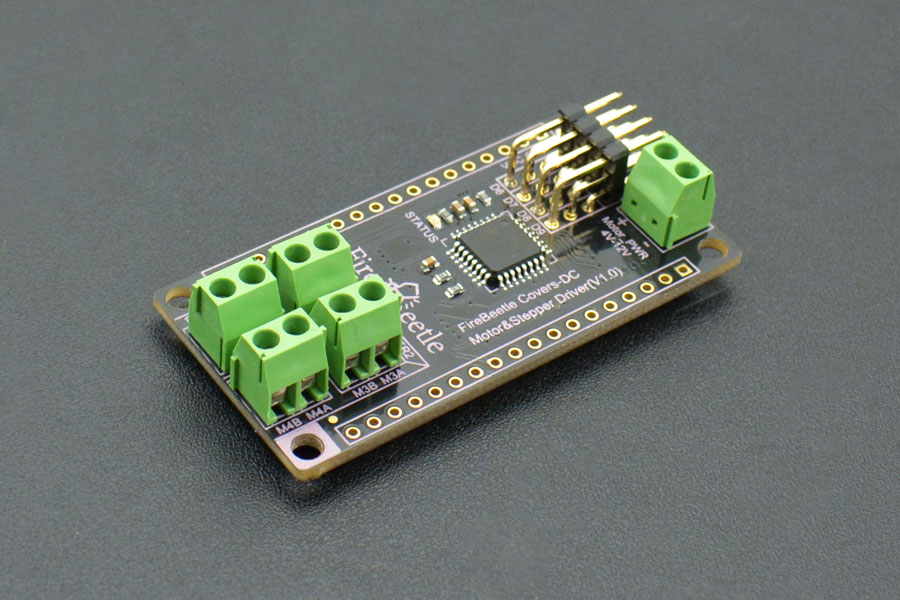

# DFRobot_MotorStepper
- [English Version](./README.md)

DFRobot FireBeetle萤火虫系列是专为物联网设计的低功耗开发组件。此款FireBeetle Covers-DC Motor&Stepper <br>
Driver模块，是针对FireBeetle系列主控而设计的电机驱动器。它可以同时驱动四路直流电机驱动或者两路二相四线步进电机，通过连接标注的I2C接口到主控，可以对各个电机接口进行配置和驱动。<br>




## 产品链接 (https://www.dfrobot.com.cn/goods-1537.html)
 DFR0508:FireBeetle四路电机驱动板

## Table of Contents

  * [概述](#概述)
  * [库安装](#库安装)
  * [方法](#方法)
  * [兼容性](#兼容性)
  * [历史](#历史)
  * [创作者](#创作者)

## Summary

  这个库是用来控制直流电机和步进电机。包括正向旋转，反向，速度调节，停止控制>


## Installation

使用此库前，请首先下载库文件，将其粘贴到\Arduino\libraries目录中，然后打开examples文件夹并在该文件夹中运行演示。

## 方法

```C++
  /**
   * @fn init
   * @brief 打开直流电机和步进电机驱动硬件,读取信息。
   */
   void init(void);

  /**
   * @fn shutdown
   * @brief 关闭直流电机和步进电机驱动硬件。
   */
  void shutdown(void);

  /**
   * @fn stop
   * @brief 电机停止转动。
   */
  void stop(void);

  /**
   * @fn start
   * @brief 直流电机设定方向并开始旋转。
   * @param dir  设置方向.
   * @n   CW: 正向旋转.
   * @n   CCW: 逆向旋转.
   */
  void start(uint8_t dir);

  /**
   * @fn start
   * @brief 步进电机旋转角度、速度、方向控制，并开始旋转。
   * @param angle  设置旋转分辨率
   * @param speed 设定转速，转速范围为0~1023，设为0表示0r/min;设置为1023表示200转/分 (最大).
   * @n            Min:0  Max:1023
   * @param dir  Set Orientation.
   * @n   CW: 正向旋转.
   * @n   CCW: 逆向旋转.
   */
  void start(float angle, uint16_t speed, uint8_t dir);

  /**
   * @fn speed
   * @brief 直流电机和步进电机的速度控制
   * @param val  设置速度.
   * @n motor:0<=val<=4096   stepper:0<=val<=1023
   */
  void speed(uint16_t val);

  /**
   * @fn getDir
   * @brief 获取电机当前转动方向.
   */
  void getDir(void);
  
  /**
   * @fn Write_Motor
   * @brief 向传感器寄存器写数据
   * @param addr I2C地址
   * @param Reg 寄存器地址
   * @param buf 数据缓存地址
   * @param Num 数据个数
   */
  virtual void Write_Motor(unsigned char addr, unsigned char Reg ,unsigned char *buf, unsigned char Num);
  
  /**
   * @fn Read_Motor
   * @brief 从传感器寄存器读数据
   * @param addr I2C地址
   * @param Reg 寄存器地址
   * @param Num 数据个数,仅能为1
   * @return 寄存器数据
   */
  virtual uint8_t Read_Motor(unsigned char addr, unsigned char Reg ,unsigned char Num );

  /**
   * @fn changeSpeed
   * @brief 电机速度控制.
   * @param count 电机经历过count次的转变,由较小的转速变化为较大的转速
   * @param val1  较小的转速
   * @param val2  较大的转速
   */
  void changeSpeed(uint16_t count, uint16_t val1, uint16_t val2);
```

## 兼容性

MCU                | Work Well    | Work Wrong   | Untested    | Remarks
------------------ | :----------: | :----------: | :---------: | -----
Arduino Uno        |      √       |              |             | 
Mega2560        |      √       |              |             | 
Leonardo        |      √       |              |             | 
ESP32        |      √       |              |             | 
ESP8266        |      √       |              |             | 
M0        |      √       |              |             | 


## 历史

- 2022/03/30 - 1.0.0 版本

## 创作者

Written by fengli(li.feng@dfrobot.com), 2022.03.30 (Welcome to our [website](https://www.dfrobot.com/))
